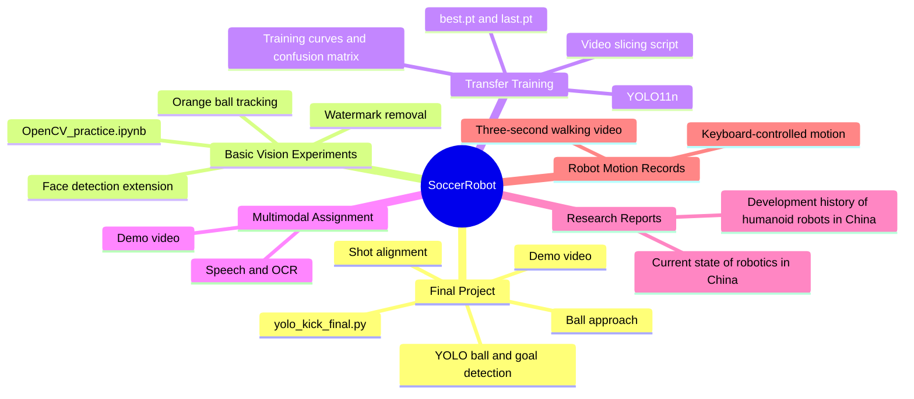
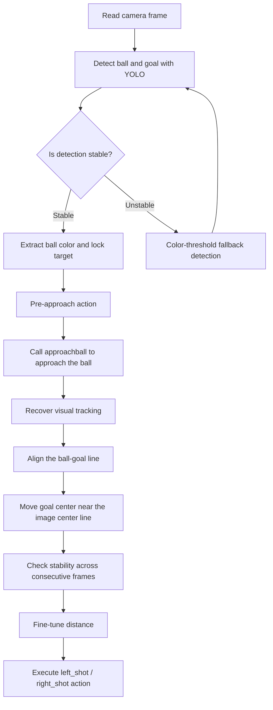

# SoccerRobot | Humanoid Soccer Robot Course Practice

This repository collects the humanoid soccer robot work for the Computer Engineering Practice course. It documents the full path from basic vision experiments, transfer training, speech and OCR practice, to the final task of detecting a soccer ball, approaching it, aligning with the goal, and shooting.

If the whole project is viewed as a small robot soccer team, this repository contains the training notes, the tactical board, and the final on-field controller: `yolo_kick_final.py`. The script connects camera input, YOLO detection, color-based fallback detection, robot action groups, and a shooting state machine into one closed-loop workflow.

## Project Overview

The goal is straightforward: let a humanoid robot complete a basic but complete soccer task chain.

1. Detect the red soccer ball in the camera image.
2. Recognize the blue goal or target goal frame.
3. Judge the geometric relationship between the ball, the goal, and the center line of the robot's view.
4. Control the robot to approach the ball while continuously adjusting its direction.
5. Execute the shooting action when the required conditions are met.

The core program is not only a detection script. It is a compact robot control system that combines perception, decision-making, and action. It reads camera frames, updates the positions of the ball and goal, approaches the ball, and then enters an alignment and shooting state machine that gradually places the robot into a suitable shooting posture.

## Repository At A Glance

If your Markdown previewer supports Mermaid, the diagram below will render as a mind map.



## Repository Structure

```text
SoccerRobot/
├─ README.md
├─ README.en.md
├─ yolo_kick_final.py
├─ 大作业最主要代码解释.md
├─ 人形机器人大作业_YOLO识别方法.zip
├─ 识别射门效果_完整视频在微信群.mp4
├─ 机器人行走视频/
│  ├─ 3秒行走视频.mp4
│  └─ 键盘控制运动.mp4
├─ 研究报告/
│  ├─ 中国机器人发展现状调研报告.md
│  └─ 中国人形机器人发展历程调研报告：从“蹒跚学步”到“具身智能”的飞跃.md
├─ 第三次课作业/
│  ├─ OpenCV_practice.ipynb
│  ├─ 橙色小球追踪.mp4
│  ├─ 橙色小球跟踪.png
│  ├─ 除水印.png
│  ├─ 除去水印.png
│  └─ detect拓展/
│     ├─ detect.py
│     ├─ detect.mp4
│     └─ haarcascade_frontalface_default.xml
├─ 第四次课作业之迁移训练/
│  ├─ args.yaml
│  ├─ results.csv
│  ├─ results.png
│  ├─ confusion_matrix.png
│  ├─ BoxP_curve.png / BoxR_curve.png / BoxF1_curve.png / BoxPR_curve.png
│  ├─ weights/
│  │  ├─ best.pt
│  │  └─ last.pt
│  └─ 视频切片脚本/
│     ├─ 视频切片.py
│     ├─ input.mp4
│     └─ output_images/
└─ 第五次课作业/
   ├─ Speech&OCR.ipynb
   └─ 效果视频.mp4
```

## Core Files

| File / Folder | Purpose |
| --- | --- |
| `yolo_kick_final.py` | Final project controller. It handles YOLO detection, color fallback, camera access, robot action calls, ball approach, goal alignment, and the shooting workflow. |
| `大作业最主要代码解释.md` | Detailed explanation of `yolo_kick_final.py`, including the state machine, thread relationship diagram, and key functions. |
| `第四次课作业之迁移训练/weights/best.pt` | YOLO weights from transfer training, usable as the model file for ball and goal detection. |
| `第四次课作业之迁移训练/args.yaml` | YOLO training parameter record for tracing the model configuration. |
| `第四次课作业之迁移训练/视频切片脚本/视频切片.py` | Splits videos into images by frame interval, making it easier to build a detection dataset. |
| `第三次课作业/OpenCV_practice.ipynb` | Basic OpenCV practice, including image processing and vision experiments. |
| `第三次课作业/detect拓展/detect.py` | Local camera detection extension based on OpenCV, including face detection and red target extraction. |
| `第五次课作业/Speech&OCR.ipynb` | Course practice related to speech and OCR. |
| `研究报告/` | Research materials on the robotics industry and the development history of humanoid robots. |
| `机器人行走视频/` | Demo materials for robot walking and keyboard-controlled motion. |

## Tech Stack

- Python
- OpenCV
- NumPy
- Ultralytics YOLO
- Jupyter Notebook
- Hiwonder / TonyPi robot control interfaces
- Haar Cascade face detection
- Video slicing, object detection training, and experiment records

## Final Project: From Seeing The Ball To Taking The Shot

`yolo_kick_final.py` is the central program in this project. Its runtime logic is similar to the internal workflow of a small robot soccer player:



### Key Design Points

1. **Camera adaptation**: Supports the robot camera, a regular OpenCV camera, or a video source.
2. **Action adaptation**: Calls robot action groups in the real robot environment, and falls back to dry-run mode when the robot SDK is unavailable.
3. **YOLO + color fallback**: Uses YOLO as the main detection channel, and HSV color thresholding as a fallback for the red ball and blue goal.
4. **Thread coordination**: The main thread handles visual detection and display, while a background thread handles alignment and shooting decisions after the approach stage.
5. **State machine control**: After approaching the ball, the robot does not shoot immediately. It goes through states such as `line_intercept`, `align_goal`, `kick_check`, and `kick`.
6. **Exception handling**: The workflow handles lost ball detection, lost goal detection, alignment timeout, and unavailable robot action interfaces.

## Runtime Environment

A regular computer can run the visual detection and dry-run workflow. Real shooting requires the robot body, action group files, the Hiwonder / TonyPi SDK, and a suitable camera environment.

Recommended environment:

```text
Python 3.x
opencv-python
numpy
ultralytics
HiwonderSDK / TonyPi SDK (required for real robot execution)
```

Install common dependencies:

```bash
pip install opencv-python numpy ultralytics
```

## How To Run

### 1. Debug With A Computer Camera

Use this command when using a local camera and a preview window:

```bash
python yolo_kick_final.py --model "第四次课作业之迁移训练/weights/best.pt" --camera 0 --show --force-dry-run-actions
```

This runs the detection and workflow logic, but robot actions are only printed and will not control the robot.

### 2. Use The Robot Camera

```bash
python yolo_kick_final.py --model "第四次课作业之迁移训练/weights/best.pt" --camera robot --show --force-dry-run-actions
```

This is useful for checking whether the robot camera image, YOLO detection boxes, and workflow states are normal.

### 3. Execute Actions On A Real Robot

```bash
python yolo_kick_final.py --model "第四次课作业之迁移训练/weights/best.pt" --camera robot --run-on-robot
```

Before running, confirm that:

1. The robot SDK can be imported correctly.
2. Action group names match the program parameters.
3. The camera can be opened normally.
4. The red ball, blue goal, and lighting conditions are relatively stable.
5. There is enough free space around the robot to avoid collisions during motion.

## Common Parameters

| Parameter | Description |
| --- | --- |
| `--model` | Path to the YOLO model. In this repository, try `第四次课作业之迁移训练/weights/best.pt`. |
| `--camera` | Camera source. Supports `robot`, `0`, `1`, or a video path. |
| `--show` | Shows the detection preview window. |
| `--conf` | YOLO confidence threshold. Default: `0.25`. |
| `--imgsz` | YOLO inference image size. Default: `640`. |
| `--ball-class` | Ball class name. Default: `redball`. |
| `--goal-class` | Goal class name. Default: `goal`. |
| `--disable-color-fallback` | Disables HSV color fallback detection. |
| `--force-dry-run-actions` | Forces dry-run actions, printing actions instead of executing them. |
| `--run-on-robot` | Attempts to call real robot action groups. |
| `--action-cooldown` | Minimum interval between actions, used for debouncing. |

## Transfer Training Records

The fourth assignment folder keeps the key outputs from YOLO transfer training:

- `args.yaml`: training parameter record. The base model is `yolo11n.pt`, the task type is detection, the number of epochs is 50, and the image size is 640.
- `weights/best.pt`: the best-performing weights from the training process.
- `weights/last.pt`: the weights from the final training epoch.
- `results.png`, `results.csv`: training metric curves and numeric records.
- `confusion_matrix.png`, `confusion_matrix_normalized.png`: confusion matrices.
- `BoxP_curve.png`, `BoxR_curve.png`, `BoxF1_curve.png`, `BoxPR_curve.png`: detection performance curves.

This section works like the robot's pre-match training report. It shows whether the model learned to distinguish the ball and goal, and it helps decide whether more data, relabeling, or parameter tuning is needed.

## Course Assignment Thread

### Third Assignment: OpenCV Vision Basics

This part focuses on traditional vision processing, including small-ball tracking, image watermark removal, and face detection extensions. It builds the foundation for later robot vision recognition: first learn how to find objects in an image, then decide how the robot should act based on those objects.

### Fourth Assignment: YOLO Transfer Training

This part moves into deep-learning object detection. Through video slicing, data preparation, model training, and result analysis, a general YOLO model is transferred to the course scenario for soccer ball and goal detection.

### Fifth Assignment: Speech & OCR

This part explores speech and text recognition, adding more entrances for robot perception. Although it is not the core module of the final shooting pipeline, it shows the course extension from vision to multimodal interaction.

### Final Project: Soccer Robot Shooting

The final project combines the previous vision capabilities, model training results, and robot motion control to complete a closed loop from recognition to execution. The interesting part is that the program does not only see the ball. It continuously adjusts motion based on the positions of the ball and the goal until the robot is actually ready to take the shot.

## Project Results

This repository completes and organizes the following work:

- OpenCV-based image processing and basic target tracking experiments.
- YOLO-based transfer training records for soccer ball and goal detection.
- Humanoid robot walking, keyboard control, and shooting demo videos.
- Visual recognition, action control, and state-machine workflow for the robot soccer task.
- Research reports on the robotics industry and humanoid robot development.
- Final project core code and detailed explanation document.

## Possible Future Improvements

1. **Improve model robustness**: Add more ball and goal data under different lighting, viewing angles, and occlusion conditions.
2. **Optimize the action strategy**: Split the current long controller script into vision, decision, action, and configuration modules.
3. **Improve field adaptability**: Add more stable localization strategies, such as using field lines, goal posts, or field boundaries as auxiliary cues.
4. **Reduce action latency**: Optimize action cooldown time and state-machine transition conditions so the robot can react more flexibly.
5. **Add logging**: Save detection results, state transitions, and action sequences for each run to support review and debugging.
6. **Improve experiment presentation**: Add more screenshots, training comparisons, and explanations of results under different parameters.

## Notes

This repository is mainly used for course project presentation and study records. Because some code depends on a specific robot platform, SDK, action groups, and real field environment, running it directly on a regular computer may require adjustments to model paths, camera indices, class names, or action parameters.

In short, this is a robot practice repository that goes from "I can see a ball" to "I can take the shot."
