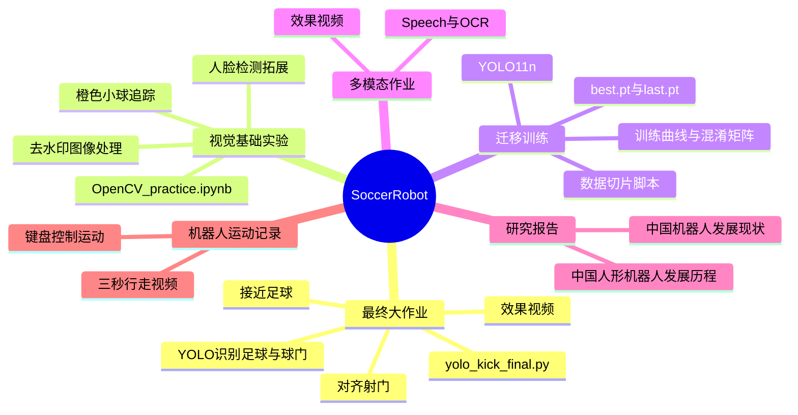
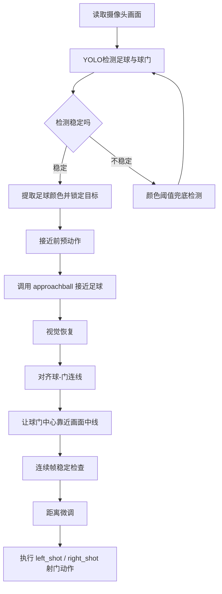

# SoccerRobot | 人形足球机器人课程实践 ⚽🤖

这是一个围绕“计算机工程实践”课程整理的人形足球机器人项目仓库。它记录了从基础视觉实验、迁移训练、语音与 OCR 实践，到最终“识别足球、接近足球、对准球门并射门”的完整探索过程。

如果把整个项目想象成一支小小的机器人球队，那么这个仓库里既有“训练日记”，也有“战术板”，还有最终上场执行的主控脚本：`yolo_kick_final.py`。它把摄像头、YOLO 检测、颜色兜底、机器人动作组和射门状态机串成了一条闭环流程。

## 项目速览

项目目标很直接：让人形机器人在足球场景中完成一个基础但完整的任务链。

1. 看见画面中的红色足球。
2. 识别蓝色球门或目标门框。
3. 判断球、门、机器人视野中线之间的几何关系。
4. 控制机器人靠近足球，并不断微调方向。
5. 在满足条件时执行射门动作。

核心程序不只是一个“检测脚本”，而是一个“感知 + 决策 + 动作”的小型机器人控制系统。它一边读取相机画面，一边更新球和球门的位置；接近足球后，再进入对齐和射门状态机，像临场调整脚步一样逐步把机器人摆到合适的射门姿态。

## 一张图看懂仓库 🧭

如果 Markdown 预览器支持 Mermaid，下面会渲染成思维导图。



## 仓库结构

```text
SoccerRobot/
├─ README.md
├─ README.en.md
├─ yolo_kick_final.py
├─ 大作业最主要代码解释.md
├─ 人形机器人大作业_YOLO识别方法.zip
├─ 识别射门效果_完整视频在微信群.mp4
├─ 机器人行走视频/
│  ├─ 3秒行走视频.mp4
│  └─ 键盘控制运动.mp4
├─ 研究报告/
│  ├─ 中国机器人发展现状调研报告.md
│  └─ 中国人形机器人发展历程调研报告：从“蹒跚学步”到“具身智能”的飞跃.md
├─ 第三次课作业/
│  ├─ OpenCV_practice.ipynb
│  ├─ 橙色小球追踪.mp4
│  ├─ 橙色小球跟踪.png
│  ├─ 除水印.png
│  ├─ 除去水印.png
│  └─ detect拓展/
│     ├─ detect.py
│     ├─ detect.mp4
│     └─ haarcascade_frontalface_default.xml
├─ 第四次课作业之迁移训练/
│  ├─ args.yaml
│  ├─ results.csv
│  ├─ results.png
│  ├─ confusion_matrix.png
│  ├─ BoxP_curve.png / BoxR_curve.png / BoxF1_curve.png / BoxPR_curve.png
│  ├─ weights/
│  │  ├─ best.pt
│  │  └─ last.pt
│  └─ 视频切片脚本/
│     ├─ 视频切片.py
│     ├─ input.mp4
│     └─ output_images/
└─ 第五次课作业/
   ├─ Speech&OCR.ipynb
   └─ 效果视频.mp4
```

## 核心文件说明

| 文件 / 文件夹 | 作用 |
| --- | --- |
| `yolo_kick_final.py` | 最终大作业核心程序，负责 YOLO 检测、颜色兜底、相机接入、动作调用、接近足球、对齐球门和射门流程。 |
| `大作业最主要代码解释.md` | 对 `yolo_kick_final.py` 的详细拆解，包含状态机、线程关系图和关键函数说明。 |
| `第四次课作业之迁移训练/weights/best.pt` | 迁移训练得到的 YOLO 权重，可作为识别足球和球门的模型文件使用。 |
| `第四次课作业之迁移训练/args.yaml` | YOLO 训练参数记录，可追溯模型训练配置。 |
| `第四次课作业之迁移训练/视频切片脚本/视频切片.py` | 将视频按帧间隔切成图片，便于制作检测数据集。 |
| `第三次课作业/OpenCV_practice.ipynb` | OpenCV 基础练习，包含图像处理与视觉实验。 |
| `第三次课作业/detect拓展/detect.py` | 基于 OpenCV 的本地摄像头检测拓展，包含人脸检测、红色目标提取等逻辑。 |
| `第五次课作业/Speech&OCR.ipynb` | 语音与 OCR 相关课程练习。 |
| `研究报告/` | 机器人产业与人形机器人发展历程调研材料。 |
| `机器人行走视频/` | 机器人行走、键盘控制运动等演示素材。 |

## 技术栈

- Python
- OpenCV
- NumPy
- Ultralytics YOLO
- Jupyter Notebook
- Hiwonder / TonyPi 机器人控制接口
- Haar Cascade 人脸检测
- 视频切片、目标检测训练与实验记录

## 最终大作业：从“看见球”到“踢出一脚”

`yolo_kick_final.py` 是项目中最核心的一段程序。它的运行逻辑像一个小型机器人足球队员的“脑内流程”：



### 关键设计

1. **相机适配**：既支持机器人摄像头，也支持普通 OpenCV 摄像头或视频源。
2. **动作适配**：在真实机器人环境中调用动作组；没有机器人 SDK 时可自动退化为 dry-run，便于在电脑上调试流程。
3. **YOLO + 颜色兜底**：主通道使用 YOLO 检测，丢检时用 HSV 颜色阈值尝试补偿红球和蓝门。
4. **线程协作**：主线程负责视觉检测和显示，后台线程负责接近完成后的对齐与射门决策。
5. **状态机控制**：接近足球后不急着踢，而是依次经过 `line_intercept`、`align_goal`、`kick_check`、`kick` 等状态。
6. **异常保护**：球丢失、门丢失、对齐超时、机器人动作接口不可用等情况都有相应处理。

## 运行环境

普通电脑可以运行视觉检测和 dry-run 流程；真实射门需要机器人本体、动作组文件、Hiwonder / TonyPi SDK 和摄像头环境。

推荐环境：

```text
Python 3.x
opencv-python
numpy
ultralytics
HiwonderSDK / TonyPi SDK（真实机器人运行时需要）
```

安装常见依赖：

```bash
pip install opencv-python numpy ultralytics
```

## 如何运行

### 1. 在电脑上用摄像头调试

如果使用本机摄像头，并希望打开预览窗口：

```bash
python yolo_kick_final.py --model "第四次课作业之迁移训练/weights/best.pt" --camera 0 --show --force-dry-run-actions
```

这会执行检测和流程逻辑，但动作组只打印，不会真的控制机器人。

### 2. 使用机器人摄像头

```bash
python yolo_kick_final.py --model "第四次课作业之迁移训练/weights/best.pt" --camera robot --show --force-dry-run-actions
```

适合先验证机器人相机画面、YOLO 识别框和流程状态是否正常。

### 3. 在真实机器人上执行动作

```bash
python yolo_kick_final.py --model "第四次课作业之迁移训练/weights/best.pt" --camera robot --run-on-robot
```

运行前请确认：

1. 机器人 SDK 可以正常导入。
2. 动作组名称与程序参数一致。
3. 摄像头能正常打开。
4. 场地中红球、蓝门和光照条件相对稳定。
5. 机器人周围留有足够空间，避免动作碰撞。

## 常用参数

| 参数 | 说明 |
| --- | --- |
| `--model` | YOLO 模型路径。仓库中可尝试使用 `第四次课作业之迁移训练/weights/best.pt`。 |
| `--camera` | 摄像头来源，支持 `robot`、`0`、`1` 或视频路径。 |
| `--show` | 显示检测预览窗口。 |
| `--conf` | YOLO 置信度阈值，默认 `0.25`。 |
| `--imgsz` | YOLO 推理尺寸，默认 `640`。 |
| `--ball-class` | 足球类别名，默认 `redball`。 |
| `--goal-class` | 球门类别名，默认 `goal`。 |
| `--disable-color-fallback` | 关闭 HSV 颜色兜底检测。 |
| `--force-dry-run-actions` | 强制动作 dry-run，只打印动作，不真实执行。 |
| `--run-on-robot` | 尝试调用真实机器人动作组。 |
| `--action-cooldown` | 动作之间的最小间隔，用于防抖。 |

## 迁移训练记录

第四次课作业部分保存了 YOLO 迁移训练的关键产物：

- `args.yaml`：训练参数记录，模型基础为 `yolo11n.pt`，任务类型为检测，训练轮数为 50，图像尺寸为 640。
- `weights/best.pt`：训练过程中表现最好的权重。
- `weights/last.pt`：最后一轮训练权重。
- `results.png`、`results.csv`：训练指标曲线和数值记录。
- `confusion_matrix.png`、`confusion_matrix_normalized.png`：混淆矩阵。
- `BoxP_curve.png`、`BoxR_curve.png`、`BoxF1_curve.png`、`BoxPR_curve.png`：检测性能曲线。

这部分像是机器人的“赛前训练成绩单”：它告诉我们模型有没有学会分辨球和门，也能帮助后续判断是否需要补充数据、重新标注或调参。

## 课程作业脉络

### 第三次课作业：OpenCV 视觉基础

这一部分主要围绕传统视觉处理展开，包括小球追踪、图像去水印、人脸检测拓展等内容。它为后面的机器人视觉识别打基础：先学会“从画面中找东西”，再谈机器人如何根据目标行动。

### 第四次课作业：YOLO 迁移训练

这一部分进入深度学习目标检测。通过视频切片、数据整理、模型训练和结果分析，把通用 YOLO 模型迁移到课程场景中的足球和球门识别任务上。

### 第五次课作业：Speech & OCR

这一部分探索语音与文字识别，为机器人感知能力增加更多入口。虽然它不是最终射门链路的核心模块，但体现了课程从视觉到多模态交互的扩展。

### 大作业：足球机器人射门

最终大作业把前面的视觉能力、模型训练成果和机器人动作控制结合起来，完成从识别到执行的闭环。它最有意思的地方在于：程序不是只“看见球”，而是要根据球和门的位置持续调整动作，直到机器人真正具备“踢这一脚”的条件。

## 项目成果

本仓库完成并整理了以下内容：

- 基于 OpenCV 的图像处理和基础目标追踪实验。
- 基于 YOLO 的足球与球门迁移训练记录。
- 人形机器人行走、键盘控制和射门效果视频。
- 机器人足球任务中的视觉识别、动作控制和状态机流程。
- 机器人行业与人形机器人发展主题研究报告。
- 最终大作业核心代码及详细解释文档。

## 后续可以改进的方向 🌱

1. **提升模型鲁棒性**：补充更多不同光照、角度、遮挡条件下的球和球门数据。
2. **优化动作策略**：把当前较长的主脚本拆成视觉、决策、动作、配置几个模块。
3. **增强场地适应能力**：加入更稳定的定位策略，例如地面线、球门柱或场地边界辅助判断。
4. **减少动作延迟**：优化动作冷却时间和状态机切换条件，让机器人反应更灵活。
5. **增加日志记录**：保存每次运行的检测结果、状态切换和动作序列，方便复盘。
6. **完善实验展示**：补充更多截图、训练对比图和不同参数下的效果说明。

## 说明

本仓库主要用于课程项目展示与学习记录。由于部分代码依赖具体机器人平台、SDK、动作组和真实场地环境，直接在普通电脑上运行时可能需要调整模型路径、摄像头编号、类别名称或动作参数。

总之，这是一个从“我看见一个球”走向“我可以踢这一脚”的机器人实践仓库。⚽
