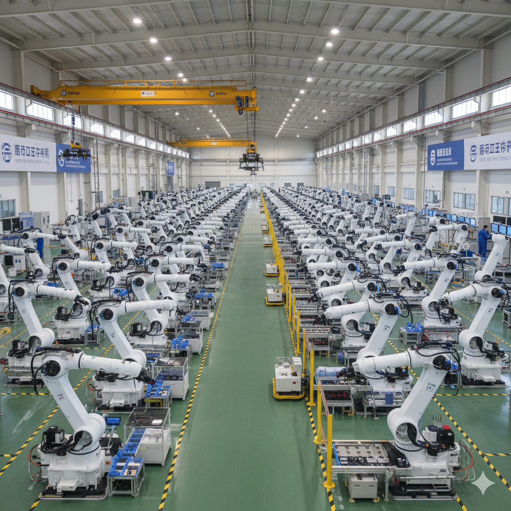

# 中国机器人发展现状调研报告（2026）

## 一、产业规模与市场地位
中国已连续12年稳居全球最大工业机器人市场，2025年工业机器人装机量达39.2万台，占全球总装机量的57%，工业机器人密度达396台/万人，远超全球平均水平。2025年中国机器人整体市场规模突破8000亿元，全球占比达35%，是全球最大、增长最快的机器人市场。在人形机器人领域，2025年全球出货约1.3万台，中国包揽90%的份额，2026年国内出货量预计达6.25万台，同比暴涨650%。

## 二、产业链与核心技术突破
中国机器人产业已形成完整的产业链体系，核心零部件国产化进程加速。减速器、伺服电机、控制器等四大关键环节国产化率已高达75%-90%，谐波减速器国产份额超40%，RV减速器寿命突破10万小时，精度对标日系品牌，价格仅为进口产品的40%。伺服电机扭矩密度达到8.2牛米/公斤，超过日本安川的5.8牛米/公斤，能耗降低33%。控制器响应速度压缩到1毫秒，远超德国库卡的5毫秒，算力实现反超。

## 三、应用场景与行业渗透
### 工业领域
工业机器人已应用于国民经济71个行业大类、236个行业中类，在新能源汽车、3C电子、金属加工等领域应用尤为广泛。2025年工业机器人销量达33.2万台，其中3C电子、金属加工领域占比超50%。在新能源汽车产业，机器人广泛应用于焊接、装配、涂装等环节，推动产业智能化升级。

### 服务领域
服务机器人在家用服务、仓储物流、商用服务、养老助残、医疗康复等领域的渗透率显著提升。家用服务机器人以清洁、陪护、教育、安防为主，商用服务机器人覆盖酒店、商超、楼宇、医疗、文旅、康养、公共清洁等场景。2024年，中国厂商在全球商用服务机器人市场中占据主导地位，出货量占比高达84.7%。

.png)

## 四、政策支持与产业生态
中国已形成"国家战略 + 专项政策 + 地方配套"的多层次政策支持体系。《"十四五"机器人产业发展规划》明确提出到2025年关键零部件国产化率达70%以上，制造业机器人密度较2020年翻番。《人形机器人创新发展指导意见》将人形机器人纳入"国家战略科技力量"范畴，明确2025年核心部件自主可控率超80%的目标。全国近400所高校成功备案"机器人工程"专业，700余所高职院校开设工业机器人技术专业，为产业发展提供人才保障。

.png)

## 五、挑战与未来展望
-1772977021592-5.png)尽管中国机器人产业取得显著成就，但仍面临高端力矩传感器、特定型号谐波减速器依赖进口等挑战。未来，随着人工智能、数字孪生等技术与机器人深度融合，以及制造业向高端化、智能化、绿色化转型的持续推进，中国机器人产业将迎来更大发展空间。预计2030年具身智能产业规模达4000亿元，2035年有望突破万亿元大关。

