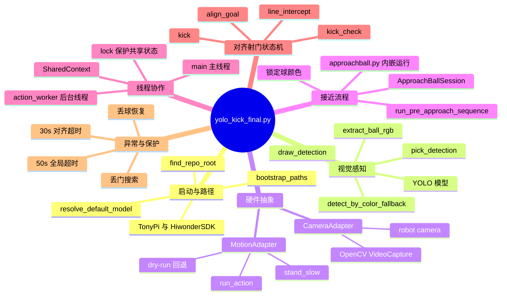
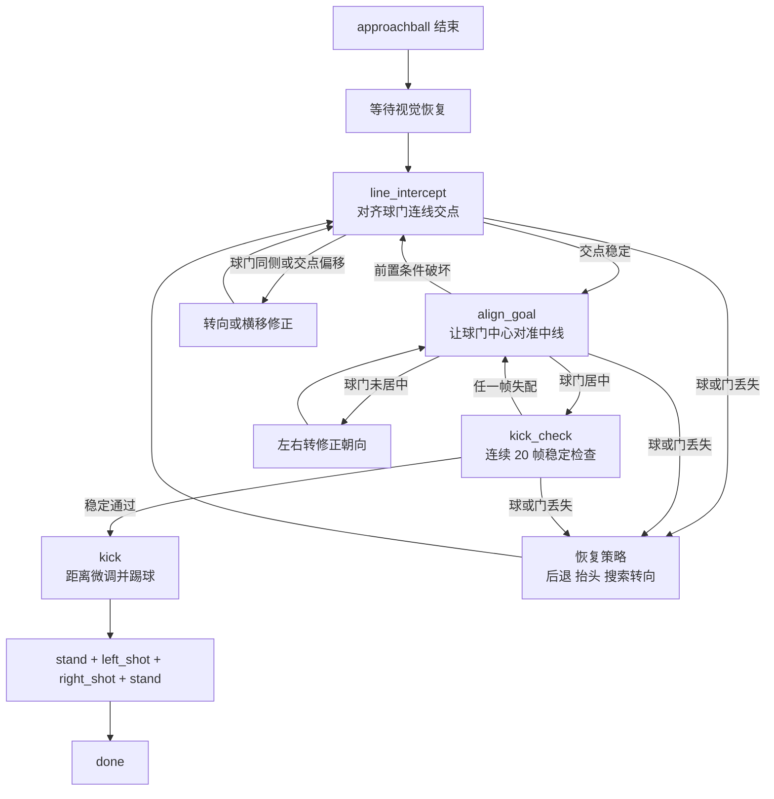
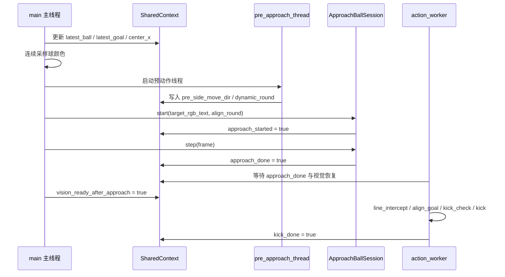

# `yolo_kick_final.py` ◎ 代码详解

> 蓝色：路径、模型、视觉相关
> 绿色：流程、状态、线程协作
> 橙色：动作、机器人执行
> 红色：注意点、风险、异常分支

## 0. ✦ 全局思维导图

> 如果 Markdown 预览器支持 Mermaid，下面会直接渲染成思维导图。

## 0.1 ▸ 对齐射门状态机导图

## 0.2 ▸ 主线程与后台线程关系图

---
> ◇ 小提示：下面进入正文讲解。

## 1. ✦ 文件定位与总体目标

这份脚本是一个“感知 + 行为”融合的足球踢球流程控制器，目标是：

1. 用 YOLO（必要时结合颜色回退）持续检测球和球门。
2. 在接近阶段调用 `approachball.py`（以模块方式内嵌运行，不再单独开进程）。
3. 在接近结束后进入“对齐并射门”状态机，驱动动作组完成踢球。

可以理解为三段式：

1. 颜色锁定与预动作（pre-approach）
2. approachball 接近流程
3. 对齐+踢球（align_and_shoot）

---
> ◇ 小提示：下面进入下一部分。

## 2. ✦ 代码架构概览

## 2.1 ▸ 核心模块分层

1. 环境与路径层
2. 硬件抽象层（相机、动作执行）
3. 视觉层（YOLO 检测 + 颜色回退 + 可视化）
4. 协调层（共享上下文、线程、状态机）
5. 主控入口（`main()`）

## 2.2 ▸ 关键类与函数清单

1. `find_repo_root` / `bootstrap_paths` / `resolve_default_model`
2. `Detection`（检测结果数据结构）
3. `CameraAdapter`（机器人相机与 OpenCV 相机统一接口）
4. `MotionAdapter`（真实动作与 dry-run 统一接口）
5. `SharedContext`（线程共享状态）
6. `ApproachBallSession`（将 `approachball.py` 当模块驱动）
7. `run_pre_approach_sequence`（接近前预对齐）
8. `action_worker`（对齐+踢球状态机，后台线程）
9. `main`（主线程：视觉与流程调度）

---
> ◇ 小提示：下面进入下一部分。

## 3. ✦ 启动与路径机制

## 3.1 ▸ `find_repo_root(start)`（18-23）

逻辑：从当前脚本路径向上查找，遇到包含 `TonyPi` 目录的位置就认为是仓库根目录 `repo_root`。  
如果没找到，则退回到脚本所在目录的父目录。

意义：减少硬编码路径，使脚本可在仓库内不同位置运行。

## 3.2 ▸ `bootstrap_paths(repo_root)`（26-33）

向 `sys.path` 注入：

1. `repo_root`
2. `repo_root/TonyPi`
3. `repo_root/TonyPi/HiwonderSDK`

意义：保证后续 `hiwonder.*`、`TonyPi.*` 模块可导入。

## 3.3 ▸ `resolve_default_model(repo_root, model_arg)`（35-46）

模型路径优先级：

1. 命令行 `--model`
2. `models/best.pt`

若都不存在，返回候选1（随后在 `main` 里统一报错）。

---
> ◇ 小提示：下面进入下一部分。

## 4. ✦ 抽象层设计

## 4.1 ▸ `Detection` 数据类（49-55）

字段：

1. `name`：类别名
2. `conf`：置信度
3. `cx, cy`：框中心坐标
4. `xyxy`：边界框坐标

这让后续逻辑不依赖 YOLO 原始对象，便于统一处理。

## 4.2 ▸ `CameraAdapter`（58-87）

支持两种源：

1. `source='robot'`：`hiwonder.Camera` 接口
2. 其他：OpenCV `VideoCapture`

外部统一调用：

1. `read()`
2. `close()`

好处：主流程不需要关心底层相机实现差异。

## 4.3 ▸ `MotionAdapter`（89-127）

核心思想：动作执行可自动降级。

1. 若 `run_on_robot=True`，尝试导入动作组模块：
   - `hiwonder.ActionGroupControl`
   - `TonyPi.HiwonderSDK.hiwonder.ActionGroupControl`
2. 任一失败不会崩溃，回退到 dry-run（打印动作而不执行）。

统一接口：

1. `run_action(action, times)`
2. `stand()`（固定执行 `stand_slow`）

---
> ◇ 小提示：下面进入下一部分。

## 5. ✦ 云台控制辅助函数

## 5.1 ▸ `set_head_pose_for_pre_approach`（129-149）

在程序早期把头部伺服设置为：

1. 1号舵机到最小（俯仰）
2. 2号舵机到中心（水平）

目的：让“接近前”的视觉视场更稳定。

## 5.2 ▸ `tilt_head_up_step`（152-178）

当目标（尤其球门）丢失时，上抬头部一步（默认 +20），并记录最新位置到 `ctx.head_servo1_pos`。

用途：作为搜索策略的一部分。

---
> ◇ 小提示：下面进入下一部分。

## 6. ✦ 线程共享上下文 `SharedContext`（181-199）

这份类是整套系统的“控制总线”，关键字段：

1. 流程标志：
   - `phase`：`detect_ball_color` / `approach_running` / `align_and_shoot` / `done`
   - `approach_started` / `approach_done` / `kick_done`
2. 视觉数据：
   - `latest_ball` / `latest_goal`
   - `center_x`
3. 控制参数：
   - `dynamic_round`
   - `pre_side_move_dir`
4. 同步与退出：
   - `vision_ready_after_approach`
   - `exit_requested`
   - `program_start_ts`

所有线程读写时都用 `ctx.lock` 保护，避免竞态。

---
> ◇ 小提示：下面进入下一部分。

## 7. ✦ `approachball.py` 的内嵌会话封装

## 7.1 ▸ `load_approach_module`（242-249）

用 `importlib.util.spec_from_file_location` 动态加载外部脚本为模块。

## 7.2 ▸ `ApproachBallSession`（202-239）

封装了三个动作：

1. `start(...)`：
   - 设置 `debug`、`align_round`
   - 调用模块的 `init/reset/start`
   - 用锁定颜色设置目标球色
2. `step(frame)`：
   - 把主线程读到的帧交给 `approachball.run(...)`
   - 根据 `kick_ready_to_exit` 判断是否结束
3. `abort()`：异常或退出时调用 `stop()`

要点：不是开新进程，而是“共享主线程相机帧”的 in-process 模式。

---
> ◇ 小提示：下面进入下一部分。

## 8. ✦ 参数系统 `parse_args()`（252-299）

## 8.1 ▸ 感知参数

1. `--model`：模型路径
2. `--camera`：相机源（默认 `robot`）
3. `--conf`、`--imgsz`、`--device`
4. `--ball-class`、`--goal-class`
5. `--disable-color-fallback`：关闭 HSV 回退
6. `--stable-frames`：颜色锁定稳定帧数
7. `--roi-scale`：取色 ROI 比例

## 8.2 ▸ 接近流程参数

1. `--approach-script`：默认 `approachball.py`
2. `--dry-run-subprocess`：跳过接近，直接进入后对齐

## 8.3 ▸ 动作执行策略参数

1. `--run-on-robot`、`--force-dry-run-actions`
2. 各动作名：`turn/move/shot/back/forward` 等
3. 动作次数：`--turn-times`、`--move-times` 等
4. 容差参数：
   - `line-align-tol`
   - `center-align-tol`
   - `goal-face-tol`
   - `ball-hold-tol`
5. 冷却时间：`--action-cooldown`

---
> ◇ 小提示：下面进入下一部分。

## 9. ✦ 视觉处理函数

## 9.1 ▸ `extract_ball_rgb`（302-327）

输入球框后，在中心 ROI 内做中值统计，输出：

1. `rgb=(r,g,b)`
2. ROI 的框坐标（用于调试显示）

中值（median）相对均值更抗噪点。

## 9.2 ▸ `pick_detection`（329-350）

从 YOLO 结果里筛选指定类别，并取最高置信度那一个。

## 9.3 ▸ `draw_detection`（353-360）

画框、画中心点、写标签。

## 9.4 ▸ `detect_by_color_fallback`（377-400）

当 YOLO 丢球或丢门时可补偿：

1. 红色阈值找球
2. 蓝色阈值找球门
3. 用最大轮廓构造 `Detection`

这是“鲁棒性兜底”，不是主检测通道。

---
> ◇ 小提示：下面进入下一部分。

## 10. ✦ 预动作逻辑 `run_pre_approach_sequence`（403-501）

这是在正式进入 `approachball` 前的一次快速几何调整。

## 10.1 ▸ 早退条件

若初始 `ball_cy0 > 0.4*h`，直接跳过预动作。

含义：球已经比较近，没必要做额外横移。

## 10.2 ▸ 中线附近直冲策略

若当前误差 `|err| <= 0.7 * pre_center_tol`，直接 `go_forward_fast x6`，并触发程序退出标志：

1. `ctx.exit_requested = True`
2. `ctx.phase = done`
3. `ctx.kick_done = True`

这段是一个“快速终止分支”，属于非常激进的策略。

## 10.3 ▸ 单方向横移 + 过冲一次

若误差明显，选定 `first_side_dir`（只选一次）并持续横移：

1. 直到球越过中线并超过容差（过冲触发）
2. 再补一次同方向动作
3. 结束预动作

最后把结果写入 `ctx.pre_side_move_dir`，供后续搜索方向决策使用。

---
> ◇ 小提示：下面进入下一部分。

## 11. ✦ 后台状态机 `action_worker`（502-865）

这是接近结束后的“对齐并射门”主决策器，运行在后台线程。

## 11.1 ▸ 阶段切换前等待

先等待：

1. `approach_started=True`
2. `approach_done=True`
3. 视觉恢复就绪 `vision_ready_after_approach=True`

满足后进入 `phase='align_and_shoot'`。

## 11.2 ▸ 三层超时保护

1. 若 30s 都没进入 kick 阶段：`go_forward_fast x5` 并结束
2. 程序总运行超过 50s：同样强制结束
3. 动作冷却 `action_cd` 防抖

## 11.3 ▸ 状态机状态定义

1. `line_intercept`：先对齐“球-门连线与底边交点”
2. `align_goal`：再让球门中心朝向中线
3. `kick_check`：静稳检查 20 帧
4. `kick`：最后距离微调并执行踢球动作

## 11.4 ▸ 关键几何量

1. `ball_err = ball.cx - center_x`
2. `goal_err = goal.cx - center_x`
3. 估算连线与 `y=h_ref` 的交点 `x_intersect`
4. `inter_err = x_intersect - center_x`
5. `same_side`：球与门是否同侧（相对中心线）

### 交点计算说明

1. 若 `dx` 近 0（连线近垂直），直接令 `x_intersect = ball.cx`
2. 否则按参数方程推到 `y=h_ref` 的交点 x

这比只看 `ball_err` 或 `goal_err` 更接近“射门线路是否穿过中线”的目标。

## 11.5 ▸ 各状态行为

### A) ◦ `line_intercept`

1. 若球和门同侧：原地转向（同侧右转右、同侧左转左）
2. 若异侧但交点误差超阈值：左右平移修正 `inter_err`
3. 满足阈值后转入 `align_goal`

### B) ◦ `align_goal`

1. 若前置条件破坏（同侧或交点偏差变大）回退到 `line_intercept`
2. 若 `|goal_err| <= goal_tol`，进入 `kick_check`
3. 否则通过左右转继续把门摆正

### C) ◦ `kick_check`

1. 需要连续 20 帧满足交点稳定
2. 任一帧失配则回退到 `align_goal`
3. 达标后进入 `kick`

### D) ◦ `kick`

1. 先看球顶点高度 `ball_top_y`，做前后小步距离补偿
2. 距离合适后执行：
   - `stand`
   - `left_shot`
   - `stand`
   - `right_shot`
   - `stand`
3. 写 `ctx.kick_done=True` 并结束线程

## 11.6 ▸ 丢失目标时的恢复策略

1. 球丢失：
   - `kick_check` 下回退
   - `align_goal` 下若门也丢失则抬头并按预方向搜索；若门在则后退一步
   - 其他情况下根据 `dynamic_round` 或后退动作恢复
2. 门丢失：
   - 抬头 + 根据 `pre_side_move_dir` 方向转向搜索

---
> ◇ 小提示：下面进入下一部分。

## 12. ✦ 主线程 `main()` 逐步时序（867-1128）

1. 解析参数、定位根目录、注入路径
2. 导入 YOLO、加载模型、加载 approachball 模块
3. 初始化相机、动作适配器、共享上下文
4. 预置云台姿态
5. 启动 `action_worker` 后台线程
6. 主循环：
   - 读帧
   - YOLO 检测 + 颜色回退
   - 更新 `ctx.latest_ball/goal`
   - 可视化覆盖层
   - 当球出现后连续采样颜色，达到 `stable_frames` 锁定颜色
   - 启动 `pre_approach_thread`
   - 预动作结束后启动 `approach_session.start(...)`
   - `phase=approach_running` 时，帧直接喂给 `approach_session.step(...)`
7. 当 `kick_done` 或用户按键退出，进入 `finally`：
   - `stop_event.set()`
   - `worker.join(...)`
   - `approach_session.abort()`
   - 释放相机与窗口

---
> ◇ 小提示：下面进入下一部分。

## 13. ✦ 设计亮点

1. 线程职责清晰：
   - 主线程专注视觉与流程编排
   - 后台线程专注动作状态机
2. 多重容错：
   - 硬件导入失败自动 dry-run
   - YOLO 丢检时颜色回退
   - 丢球丢门时有恢复策略
3. 参数化程度高：
   - 容差、动作名、动作次数都可命令行调整

---
> ◇ 小提示：下面进入下一部分。

## 14. ✦ 需要注意的实现细节

1. `action_worker` 中 `h_ref` 来自 `getattr(args, 'height', 480)`，但参数里没有 `--height`，因此默认恒为 480。  
   这通常可运行，但如果实际图像高度不是 480，距离阈值会有比例误差。
2. `run_pre_approach_sequence` 中“中心附近直接前冲并请求退出”分支非常强，实战中可能跳过后续完整对齐踢球链路。
3. `--line-align-tol` 在当前代码未直接参与决策（主要用的是 `center_align_tol` / `goal_face_tol`），可视为预留或历史参数。

---
> ◇ 小提示：下面进入下一部分。

## 15. ✦ 总结

这份代码本质是一个“融合视觉检测、预动作校正、接近子模块、后对齐状态机”的机器人踢球控制器；它不是简单的检测脚本，而是完整的在线闭环行为系统。

